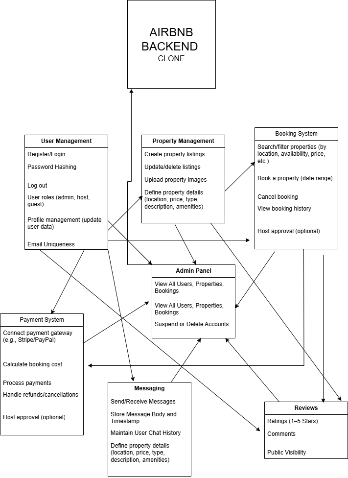

# Airbnb Clone Backend: Features and Functionalities

This document outlines the essential backend features and functionalities required for the Airbnb Clone project.

## Overview

The backend system must support:

- Secure user authentication and authorization
- Property listing and management
- Booking operations with date validation
- Payment processing and tracking
- Messaging between users
- Property reviews and ratings
- Administrative tools for oversight and moderation

## Feature Diagram

## Functional Modules

### 1. User Management
- User registration and login
- Password encryption
- Role-based access (guest, host, admin)
- Email uniqueness constraint

### 2. Property Management
- Add, edit, and delete property listings
- Assign listings to host users
- Include location, description, and price per night
- View properties by various filters (location, price range)

### 3. Booking System
- Book property for available dates
- Prevent double booking conflicts
- View booking history by user or property
- Booking status (pending, confirmed, canceled)

### 4. Payment System
- Link bookings to payments
- Support multiple payment methods (credit card, PayPal, Stripe)
- Store payment details and timestamps

### 5. Messaging
- Send and receive messages between users
- Messages include sender, recipient, body, and timestamp
- Maintain message history

### 6. Reviews
- Users can leave reviews on properties they booked
- Rating scale from 1 to 5
- Review text and timestamp recorded
- Reviews are tied to user and property

### 7. Admin Panel
- View all users, properties, bookings, and reviews
- Delete inappropriate content
- Suspend or remove users

