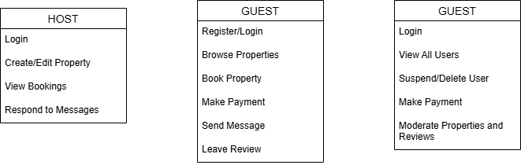

# Airbnb Clone Backend: Use Case Diagram

This diagram illustrates the interactions between users and the system for key backend functionalities.

## Actors
- Guest
- Host
- Admin

## Use Cases
- User registration and login
- Property creation and browsing
- Booking and payments
- Messaging and reviews
- Admin moderation

## Diagram

